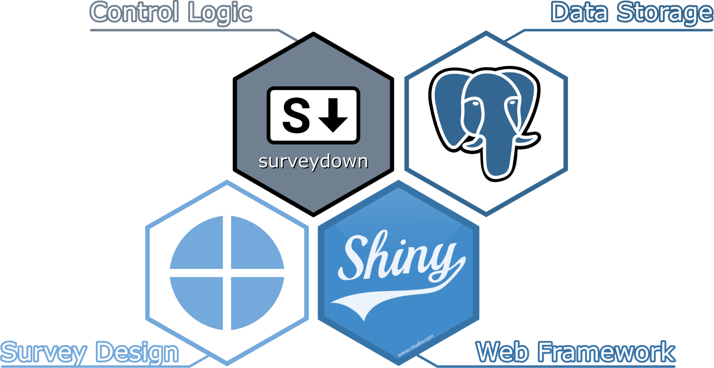

## Overview

# An error occurred.

Unable to execute JavaScript.

***Intro to surveydown by JP Helveston***

## What is surveydown?

  

**surveydown** is a flexible, open-source platform for making programmable, markdown-based surveys with , [Quarto](https://quarto.org/), [Shiny](https://shiny.posit.co/), and [PostgreSQL](https://www.postgresql.org/).

**Packages sites:** [surveydown](https://pkg.surveydown.org/) [sdstudio](https://sdstudio.surveydown.org/)

------------------------------------------------------------------------

Here’s how it works:

1.  Design your survey as a [Quarto](https://quarto.org/) document using markdown and R code.
2.  Render your survey into a [Shiny](https://shiny.posit.co/) app that can be hosted online and sent to respondents.
3.  Store survey response data in a [PostgreSQL](https://www.postgresql.org/) database. We recommend [Supabase](https://supabase.com/) as a free, secure, and easy to use option.

The **surveydown**  package provides functions to bring this all together.

  

We recommend reading the [Getting Started](docs/getting-started.llms.md) page to get a sense of how to use surveydown and perform your basic setups. The rest of the documentation covers more details on how to use surveydown.

[Click here to get started!](docs/getting-started.llms.md)

## Why surveydown?

Most survey platforms use graphic interfaces or spreadsheets to define survey content, making version control, collaboration, and reproducibility difficult or impossible. Surveydown was designed to address these problems. As an open-source, markdown-based platform, all survey content is defined using **plain text** (markdown and R code) in two files:

- `survey.qmd`: A [Quarto](https://quarto.org/) document that contains the survey content (pages, questions, etc).
- `app.R`: An R script defining a shiny app that contains global settings (libraries, database configuration, etc.) and server configuration options (e.g., conditional page skipping / conditional display, etc.).

This approach makes it easy to reproduce, share, and version control your surveys with common tools like Git. And since all survey data is stored in a [PostgreSQL](https://www.postgresql.org/) database, you have total control over where your survey data lives. We recommend [Supabase](https://supabase.com/) as a free, secure, and easy to use option.

In case you’re interested in the background behind the project, this [blog post](https://www.jhelvy.com/blog/2023-04-06-markdown-surveys/) provides something of an origin story. Note that the design discussed in the post is now quite outdated with what ultimately became surveydown.

## Authors

The surveydown project is led by professor [John Paul Helveston](https://www.jhelvy.com/) at George Washington University and was originally developed in collaboration with his students [Pingfan Hu](https://pingfanhu.com) and [Bogdan Bunea](https://www.linkedin.com/in/bogdanbt/).

As an open-source package, surveydown now has many more contributors who have added features and improved the project over time. See the [**Contributors’ Page**](https://github.com/surveydown-dev/surveydown/graphs/contributors) for details.

  

**John Paul Helveston, Ph.D.**

[John Paul Helveston](https://www.jhelvy.com) is an Associate Professor in the Department of [Engineering Management and Systems Engineering](https://emse.engineering.gwu.edu/) at George Washington University. Professor Helveston is the core designer and developer, and maintainer of both the surveydown project and this documentation website.

**Pingfan Hu**

[Pingfan Hu](https://pingfanhu.com) is a Ph.D. student in Systems Engineering at George Washington University, supervised by professor Helveston. Pingfan is mainly responsible for UI design, user interactions, and website maintenance.

**Bogdan Bunea**

[Bogdan Bunea](https://www.linkedin.com/in/bogdanbt/) is an undergraduate student majoring in Systems Engineering and minoring in Computer Science at George Washington University. Bogdan is mainly responsible for database connection and data management.

## License

See the [License](https://github.com/surveydown-dev/surveydown/blob/master/LICENSE.md) page on the source code repository.

## Publication

An associated paper in *PLOS One* about surveydown is available at <https://doi.org/10.1371/journal.pone.0331002>

## Citation

If you use this package in a publication, please cite the *PLOS One* article associated with it! You can get the citation information by typing `citation("surveydown")` into R, or copying below.

> **NOTE:**
>
> Hu P, Bunea B, Helveston J (2025). “surveydown: An open-source, markdown-based platform for programmable and reproducible surveys.” *PLOS One*, *20*(8). [doi:10.1371/journal.pone.0331002](https://doi.org/10.1371/journal.pone.0331002)

A BibTeX entry for LaTeX users is

    @Article{,
        title = {surveydown: An open-source, markdown-based platform for programmable and reproducible surveys},
        author = {Pingfan Hu and Bogdan Bunea and John Paul Helveston},
        journal = {PLOS One},
        year = {2025},
        volume = {20},
        number = {8},
        doi = {10.1371/journal.pone.0331002},
    }

## Funding

This project was partially supported by a grant from the [Alfred P. Sloan Foundation](https://sloan.org/), Grant Number G-2023-20976 awarded to PI John Paul Helveston.

Back to top
