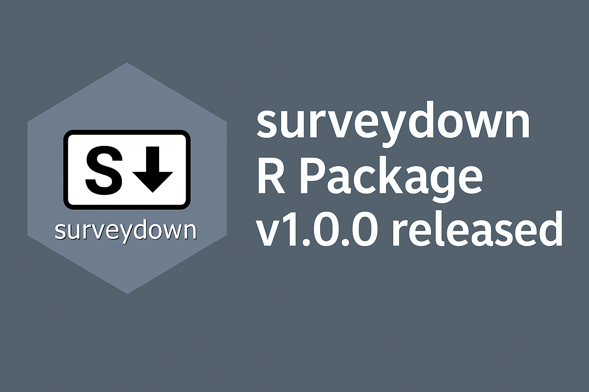
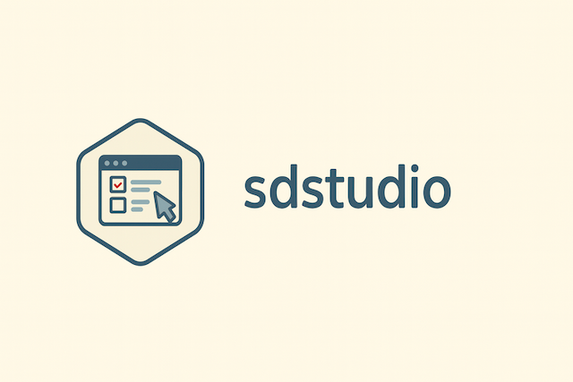
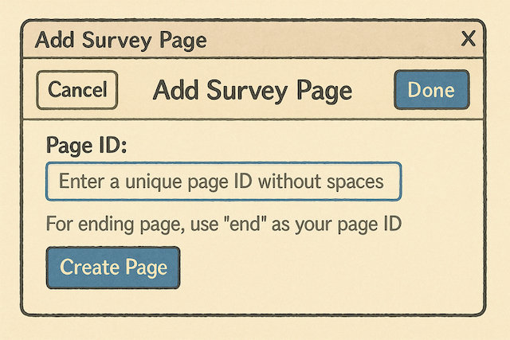
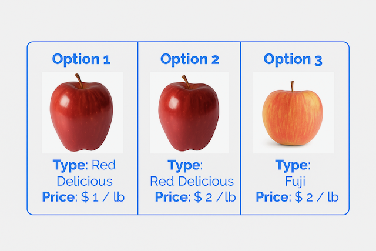

# Blog

### [Announcing surveydown v1.0.0!](blog/2025-11-21-announcing-surveydown-version-1/index.llms.md)

We are thrilled to announce the `v1.0.0` release of `surveydown`, a stable release with improvements to YAML settings, page navigation, question creation, and a smoother overall developer experience.

2025-11-21

John Paul Helveston, Pingfan Hu

### [Introducing Shorthand Page Syntax in v0.14.0](blog/2025-11-15-shorthand-page-syntax/index.llms.md)

Introducing a new shorthand syntax for page definition to make your survey code cleaner and easier to read.

2025-11-15

John Paul Helveston

### [Introducing sdstudio: A companion GUI for surveydown](blog/2025-06-29-sdstudio/index.llms.md)

[A brief walkthrough of the **sdstudio** R Package, a companion GUI for **surveydown**.](blog/2025-06-29-sdstudio/index.llms.md)

2025-06-29

John Paul Helveston, Pingfan Hu

### [surveydown Gadgets for Page and Question Creation](blog/2025-04-08-surveydown-gadgets/index.llms.md)

A brief walkthrough of surveydown gadgets for creating pages and questions using RStudio.

2025-04-08

[John Paul Helveston,](blog/2025-04-08-surveydown-gadgets/index.llms.md) [Pingfan Hu](https://pingfanhu.com)

### [surveydown is on CRAN 🎉!](blog/2024-12-20-surveydown-on-cran/index.llms.md)

It’s actually been on CRAN since v0.4.0, but we’ve been making so many updates that we’re now already on v0.7.2!

2024-12-20

John Paul Helveston

### [New architecture in v0.3.0 (and loads of breaking changes)!](blog/2024-09-18-new-app-design/index.llms.md)

We’re releasing v0.3.0, and with it multiple breaking changes.

2024-09-18

John Paul Helveston

### [Choice-based conjoint surveys in R with surveydown](blog/2024-08-28-choice-based-conjoint-surveys-with-surveydown/index.llms.md)

A how-to guide for using R to design and implement choice-based conjoint surveys using the surveydown R package

2024-08-28

John Paul Helveston

### [Introducing surveydown: A markdown-based framework for generating surveys with Quarto and shiny](blog/2024-08-21-introducing-surveydown/index.llms.md)

A quick overview of the {surveydown} R package for making markdown-based surveys with open-source technologies: Quarto, shiny, and supabase.

2024-08-21

John Paul Helveston

Back to top
