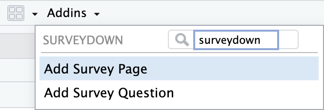
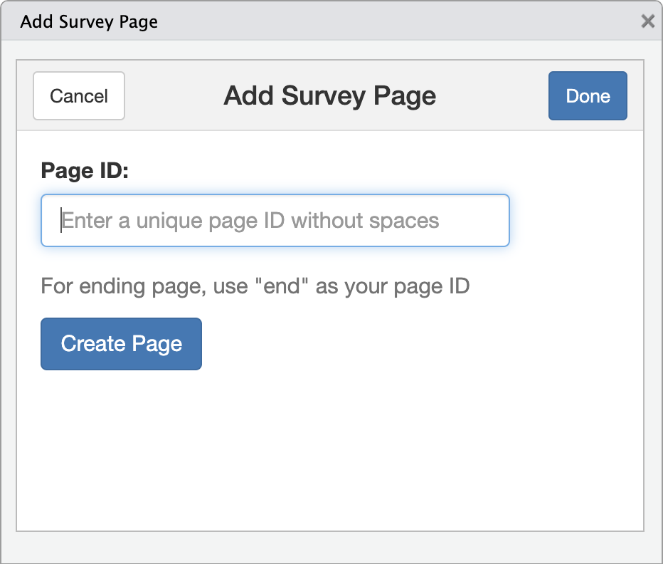
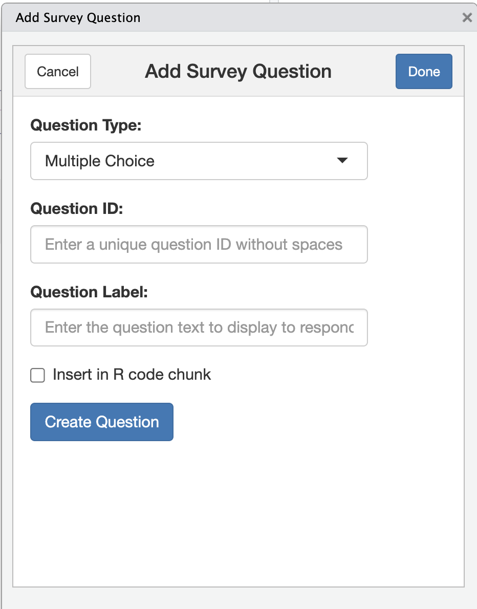

# surveydown Gadgets for Page and Question Creation

RStudio

tutorial

A brief walkthrough of surveydown gadgets for creating pages and questions using RStudio.

Author

[Pingfan Hu](https://pingfanhu.com)

Published

2025-04-08

> **NOTE:**
>
> As of version 0.10.0, surveydown now has shiny gadgets to make it easier to insert pages and questions into your survey.qmd file. This post highlights how to use them in your survey building workflow.
>
> To view a full-course survey building workflow, proceed to the [Basic Components](../../docs/basic-components.llms.md) page.

## 1 Introduction

While surveydown works with various IDEs, the gadget features perform best in RStudio. These gadgets provide a user-friendly interface for creating survey elements without having to remember the exact syntax or function parameters.

Two primary gadgets are offered by surveydown:

1.  **Survey Page Gadget** - Creates a new survey page
2.  **Survey Question Gadget** - Creates a new survey question

Here is a showcase of the **Survey Page Gadget** in RStudio:

  

  

The **Survey Question Gadget**:

  

  

As you can see, these gadgets simplify the process of adding survey components. This blog walks you through how to access and use these gadgets.

## 2 Accessing the Gadgets

The gadgets are powered by the `sd_page_gadget()` and `sd_question_gadget()` functions, but you don’t need to call these functions directly.

You can access these gadgets in RStudio in two ways:

### 2.1 Using the Addins Menu

1.  Click on the “Addins” dropdown menu in the RStudio toolbar
2.  Type “surveydown” in the search box
3.  Select either “Add Survey Page” or “Add Survey Question”

Below is a screenshot of the Addins menu with surveydown gadgets:

  

  

### 2.2 Keyboard Shortcuts (Recommended)

For more efficient workflow, set up keyboard shortcuts:

1.  Go to Tools → Addins → Browse Addins…

  

  

2.  In the Addins popup window, click on the “Keyboard shortcuts…” button on the bottom left corner.

  

  

3.  Input “survey” in the search box.

  

  

4.  Assign the following shortcuts:
    - `Ctrl+Shift+P` for the Survey Page Gadget
    - `Ctrl+Shift+Q` for the Survey Question Gadget

    Or if you have other preferences, feel free to customize them.

## 3 Using the Gadgets

### 3.1 Survey Page Gadget

  

  

The page gadget is straightforward:

1.  Press `Ctrl+Shift+P` (or use the Addins menu)
2.  Enter a Page ID (no spaces allowed)
3.  Click “Create Page” or press Enter

This will insert a properly formatted page block at your cursor position, including an R code chunk ready for adding questions.

### 3.2 Survey Question Gadget

  

  

The question gadget offers more options:

1.  Press `Ctrl+Shift+Q` (or use the Addins menu)
2.  Fill in the following:
    - **Question Type**: Select from the dropdown (default is “Multiple Choice”)
    - **Question ID**: Enter a unique identifier (no spaces)
    - **Question Label**: Enter the actual question text
3.  **R Chunk Option**: Check this box if you need the question to be inserted within an R code chunk
4.  Click “Create Question” or press Enter

Note that if you created the question inside an existing page’s R chunk, you don’t need to check the “R Chunk Option”. If you’re adding a question elsewhere and need it to be in an R chunk, check that box.

## 4 Example Workflow

Here’s how a typical workflow might look:

1.  Create a new page:
    - Press `Ctrl+Shift+P`
    - Key in your Page ID
    - Press Enter
2.  Add a question:
    - Press `Ctrl+Shift+Q`
    - Select your desired question type
    - Key in your Question ID
    - Key in your Question Label
    - Press Enter
    - Modify your Question Options as needed
3.  Add more questions as needed by repeating step 2.

By following these steps and using the gadgets, you’ll create well-structured surveys much faster than coding everything manually.

Back to top
