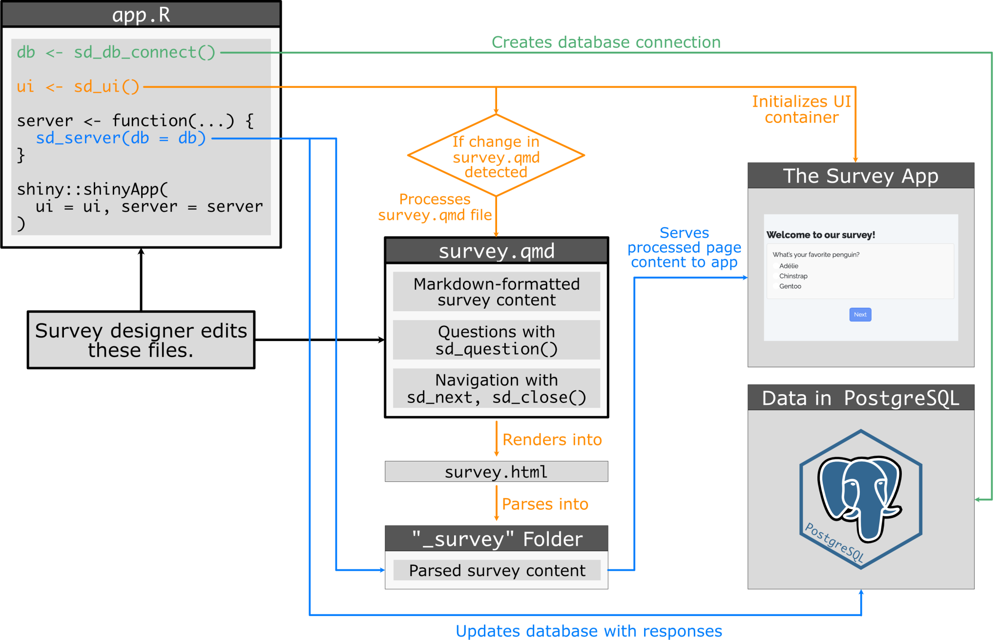

# Architecture

If you are interested in what is happening under the hood, here is a flow diagram that illustrates the overall architecture of a typical surveydown survey application:

  

  

Following this flow diagram, survey designers only need to edit **survey.qmd** and **app.R**. Since the survey is launched by **app.R**, which holds the core control logic of the survey, we’ve placed it at top left as starting point of the logic flows.

In **app.R**, we have three logic flows:

1.  `sd_db_connect()`, as colored in **green**, creates database connection.
2.  `sd_ui()`, in **orange**, serves two purposes: **1)** it renders the **survey.qmd** file into survey content in the “\_survey” folder, and re-renders if changes detected; **2)** it initializes the user interface container for the survey app.
3.  `sd_server()`, in **blue**, also serves two purposes: **1)** it grabs the generated “\_survey” folder and serves processed page content to the survey app; **2)** it updates database with responses.

On the right most part of the flow diagram, we reach to the ending point of the logic flow. The survey app is what is presented to the survey participants, and the data in PostgreSQL is a collection of survey results for survey analysts to study for. As this flow diagram illustrates, the surveydown platform is the one product that streamlines the experience of survey designers, survey participants, and survey analysts.

Back to top
