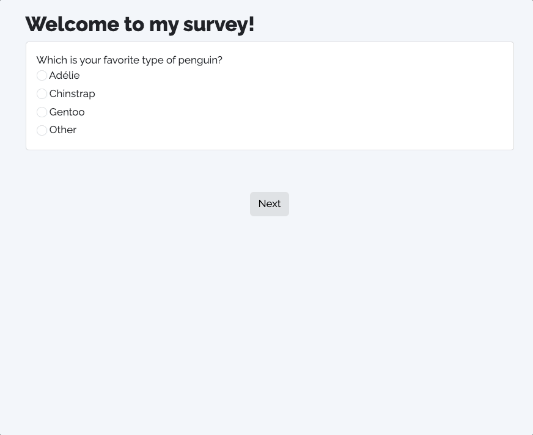
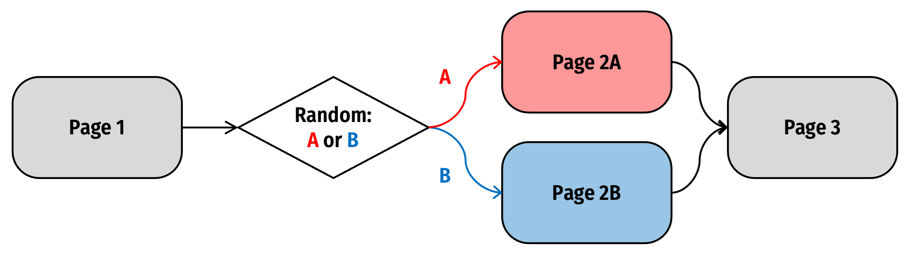

# Conditional Logic

In surveydown, there are 3 conditional logic functions you can use to control the content and flow of your survey:

1.  `sd_show_if()` to show a question or a page if a condition is `TRUE`. See details in [Conditional Showing](#conditional-showing).
2.  `sd_skip_if()` to skip forward to a page if a condition is `TRUE`. See details in [Conditional Skipping](#conditional-skipping).
3.  `sd_stop_if()` to stop the navigation if a condition is `TRUE`. See details in [Conditional Stopping](#conditional-stopping).

## Conditional Showing

### Showing Questions

It is often useful to show a **question** based on some condition, such as the respondent choosing a particular value in a multiple choice question. This can be achieved by the `sd_show_if()` function.

For example, let’s say we have a choice question about people’s favorite penguin type, and the last option is “other”. If the respondent chose it, you may want a second question to display that allows them to specify the “other” penguin type, like this:



  

To implement this, you first need to define both the **conditional question** and the **target question** in the **survey.qmd** file, like this:

```` markdown
```{r}
# Conditional question
sd_question(
  type  = "mc",
  id    = "penguins",
  label = "Which is your favorite type of penguin?",
  option = c(
    "Adélie"    = "adelie",
    "Chinstrap" = "chinstrap",
    "Gentoo"    = "gentoo",
    "Other"     = "other"
  )
)

# Target question
sd_question(
  type  = "text",
  id    = "penguins_other", 
  label = "Please specify the other penguin type:"
)
```
````

Then in the server function in the **app.R** file, you can use the `sd_show_if()` function to define that the `"penguins_other"` question would only be shown if the respondent chose the `"other"` option in the `"penguins"` question, like this:

> **NOTE:**
>
> The `sd_value()` function returns the chosen value or values for one or more questions. It is a reactive function and can only be used inside the `server()` function in your **app.R** file.
>
> See the [Accessing Question Values](../docs/accessing-values.llms.md) page for details on how to use `sd_value()`.

``` downlit
server <- function(input, output, session) {

  sd_show_if(
    sd_value("penguins") == "other" ~ "penguins_other"
  )

  sd_server(db = db)

}
```

The structure of the `sd_show_if()` function for question display is:

> `<condition> ~ "target_question_id"`

You can provide multiple conditions to the `sd_show_if()` function, each separated by a comma.

In the example above, `sd_value("penguins") == "other"` is the condition, and `"penguins_other"` is the target question that will be shown if the condition is met. The `~` symbol is used to separate the condition from the target question.

Take a look at the [Common Conditions](#common-conditions) section for examples of other types of supported conditions you can use to conditionally display questions.

### Showing Pages

You can use `sd_show_if()` to also conditionally show a **page** in a similar pattern. The structure of the `sd_show_if()` function for page display is:

``` r
sd_show_if(
  <condition_1> ~ "target_page_id_a",
  <condition_2> ~ "target_page_id_b"
)
```

Note that there are 2 condition checks and 2 target page branches in the example above. It means the navigation flow will choose from either page A or page B to show based on which condition is `TRUE`.

One use case for this is a design where you want to randomly show respondents one of a set of pages. For example, let’s say you have versions A and B of page 2 in your survey, and you want to randomly show one to each respondent. Here’s a visual explanation of this setup:



  

To implement this, you first need to define each of the pages in your **survey.qmd** file, like this (on page 1 I’m using `sd_output` to display the randomly chosen value, A or B, which we’ll define in the `server` function below):

```` markdown
--- page1

This is page 1

The next page will be page 2 `r sd_output("rand_val", type = "value")`

```{r}
sd_next()
```

--- page2a

This is page 2A

```{r}
sd_next()
```

--- page2b

This is page 2B

```{r}
sd_next()
```

--- page3

This is page 3

```{r}
sd_close()
```
````

Then in the server function in the **app.R** file, you can randomly generate a value to determine which of the page 2 version you’ll use (A or B), then condition on that value to display `page2a` or `page2b` using the `sd_show_if()` function, like this:

``` downlit
server <- function(input, output, session) {

  # Generate random condition
  rand_val <- sample(c('A', 'B'), 1)

  # Store the condition value
  sd_store_value(rand_val)

  # Use sd_show_if to show target pages
  sd_show_if(
    rand_val == 'A' ~ 'page2a',
    rand_val == 'B' ~ 'page2b'
  )

  sd_server()

}
```

This approach will hide both `page2a` and `page2b` by default and only show the page if the condition on the left hand side is `TRUE`.

Note that we’re also using `sd_store_value()` here to store the random value, A or B, in the response data so that we can know later which page was shown for each respondent.

## Conditional Skipping

While basic page navigation is handled automatically (or with the `sd_nav()` function for more fine-tuned control), you can override this static navigation in your server function with the `sd_skip_if()` function to send the respondent to a forward page based on some condition.

A common example is the need to **screen out** people based on their response(s) to a question. Let’s say you need to screen out people who do not own a vehicle. To do this, you would first define a question in your **survey.qmd** file about their vehicle ownership, e.g.:

```` markdown
```{r}
sd_question(
  type  = 'mc',
  id    = 'vehicle_ownership',
  label = "Do you own your vehicle?",
  option = c(
    'Yes' = 'yes',
    'No'  = 'no'
  )
)
```
````

You would also need to define a screenout page to send respondents to, like this:

``` r
--- screenout

Sorry, but you are not qualified to take our survey.
```

Then in the server function in the **app.R** file, you can use the `sd_skip_if()` function to define the condition under which the respondent will be sent to the target `screenout` page, like this:

``` downlit
server <- function(input, output, session) {

  sd_skip_if(
    sd_value("vehicle_ownership") == "no" ~ "screenout"
  )

  # ...other server code...

}
```

You can provide multiple conditions to the `sd_skip_if()` function, each separated by a comma. The structure for each condition is always:

> `<condition> ~ "target_page_id"`

In the example above, `sd_value("vehicle_ownership") == "no"` is the condition, and `"screenout"` is the target page that the respondent will be sent to if the condition is met.

Take a look at the [Common Conditions](conditional-logic.llms.md#common-conditions) section for examples of other types of supported conditions you can use to conditionally control the survey flow.

## Conditional Stopping

Sometimes you may want to stop the survey navigation based on some condition. For example, say you want to collect respondents’ ZIP code. In the U.S., ZIP codes are 5-digit numbers, so if a respondent enters a ZIP code that is not 5 digits long, you may want to stop the navigation and prevent them from proceeding further in the survey.

Here is how you can implement this. Firstly, in the **survey.qmd** file, you would define a question to collect the ZIP code, like this:

```` markdown
```{r}
sd_question(
  type  = "numeric",
  id    = "zip",
  label = "What's your zip code?"
)
```
````

Then, in the **app.R** file, you can use the `sd_stop_if()` function to define the condition that will stop the navigation if the ZIP code is not 5 digits long, like this:

``` downlit
server <- function(input, output, session) {

  sd_stop_if(
    # Use as_numeric = FALSE to preserve leading zeros (e.g., "01234")
    # Otherwise sd_value() would convert it to 1234 (only 4 characters)
    nchar(sd_value("zip", as_numeric = FALSE)) != 5 ~ "Zip code must be 5 digits."
  )

  sd_server(db = db)
}
```

> **TIP:**
>
> ZIP codes are a special case where you need to prevent automatic numeric conversion. Without `as_numeric = FALSE`, a ZIP code like `"01234"` would be converted to `1234`, losing the leading zero. This would cause [`nchar()`](https://rdrr.io/r/base/nchar.html) to return `4` instead of `5`, incorrectly flagging valid ZIP codes as invalid.

The structure of the `sd_stop_if()` function is:

``` r
sd_stop_if(
  <condition> ~ "error_message"
)
```

It means: if the `<condition>` is `TRUE`, display the `"error_message"` to the respondent while they attempt to trigger the navigation.

Likewise, `sd_stop_if()` supports multiple conditions, each separated by a comma. If there are more than one conditions on the same page, the error messages will be concatenated and displayed together.

## Common Conditions

This section highlights some of the most common types of conditions you might need.

> **NOTE:**
>
> While we use the `sd_show_if()` function in most of these examples, similar logic applies to `sd_skip_if()` and `sd_stop_if()`.

### Question responses

One of the most common situations is conditioning on the response of a single question or multiple questions, like this:

``` downlit
sd_show_if(

 # Simple condition based on single question choice
 sd_value("penguins1") == "other" ~ "penguins1_other",

 # Multiple condition based on multiple question choices
 sd_value("penguins2") == "other" & sd_value("show_other") == "show" ~ "penguins2_other"

)
```

In the first condition, the `penguins1` question is checked to see if the respondent chose the `"other"` option. If they did, the `penguins1_other` question will be shown.

In the second condition, the `penguins2` question is checked to see if the respondent chose the `"other"` option, and the `show_other` question is checked to see if the respondent chose the `"show"` option. With this condition, the `penguins2_other` question will only be shown if both conditions are `TRUE`.

### Numeric values

Another common condition is checking the value of a numeric question. The `sd_value()` function automatically converts numeric values, so you can use them directly in comparisons:

``` downlit
sd_show_if(
 sd_value("car_number") > 1 ~ "car_ownership"
)
```

In the condition above, the `car_number` question is checked to see if the respondent chose a number greater than 1. If they did, the `car_ownership` question will be shown.

### Multiple response questions

For multiple response question types (e.g. [`mc_multiple`](question-types.llms.md#mc_multiple)), the question returns a vector storing all the chosen values. You can use this vector to check for different conditions, such as whether the chosen values are in some set of values using the `%in%` operator, or whether the respondent chose a number of options using the [`length()`](https://rdrr.io/r/base/length.html) function, like this:

``` downlit
sd_show_if(

 # Check if the respondent chose "apple", "banana", or both
 ("apple" %in% sd_value("fav_fruits")) | ("banana" %in% sd_value("fav_fruits")) ~ "apple_or_banana",

 # Check if the respondent chose more than 3 fruits
 length(sd_value("fav_fruits")) > 3 ~ "fruit_number"

)
```

In the first example, the `fav_fruits` question is checked to see if the respondent chose `"apple"`, `"banana"`, or both; if so, the `apple_or_banana` question will be shown.

In the second example, the `fav_fruits` question is checked to see if the respondent chose more than 3 fruits; if so, the `fruit_number` question will be shown.

### Answering status

You may want to show a target question if a question is answered at all or not. To do this, we created the `sd_is_answered()` function that returns `TRUE` if a question is answered and `FALSE` otherwise.

For example, let’s say you had a multiple choice question `fav_fruit` that asked you to choose your favorite fruit from a list of options, and a target question `num_fruit` that asked how many fruit you eat per day. If we wanted to show the `num_fruit` question so long as the `fav_fruit` question is answered, we can use `sd_is_answered("fav_fruit")` in the `sd_show_if()` function, like this:

``` downlit
sd_show_if(
  sd_is_answered("fav_fruit") ~ "num_fruit" 
)
```

This way, as long as the `fav_fruit` question is answered, no matter which option the user picks the `num_fruit` question will appear.

For [`"matrix"`](question-types.llms.md#matrix) type questions, `sd_is_answered()` will only be `TRUE` if all sub-questions (matrix rows) in it are answered.

### Custom functions

For situations where the conditional logic is more complex, we recommend defining a custom function that will return a logical value (`TRUE` or `FALSE`). You can then pass this function to `sd_show_if()`, `sd_skip_if()`, or `sd_stop_if()` as a condition.

For example, let’s say we had a `mc` type question where we asked how many cars the respondent owned, and we included numeric options `1` through `5` as well as a final option `"6 or more"`. If we wanted to set a condition that would return `TRUE` if the user had more than one car, using `sd_value("car_number") > 1` as the condition would be problematic, because `sd_value()` would return `NA` when trying to convert `"6 or more"` to a number (since it contains text), and comparisons with `NA` don’t work as expected.

To address this, we could create a custom function to handle this special condition:

``` downlit
server <- function(input, output, session) {

  more_than_one_car <- function() {
    val <- sd_value("car_number")
    if (is.null(val)) {
      return(FALSE)
    }
    # For "6 or more", sd_value() returns NA after trying to convert
    # We treat NA as TRUE (more than one car)
    if (is.na(val)) {
      return(TRUE)
    }
    return(val > 1)
  }

  sd_show_if(
    more_than_one_car() ~ "car_ownership"
  )

  sd_server(db = db)

}
```

In the `more_than_one_car()` function, we first return `FALSE` if the question is not yet answered (that’s the `if (is.null(val))` part). Then we check if the value is `NA` (which happens when `sd_value()` tries to auto-convert `"6 or more"` to numeric and fails) - in that case we return `TRUE` because “6 or more” means more than one car. Otherwise, we return the simple condition `val > 1`, which will return `TRUE` if the respondent chose a number greater than 1.

Alternatively, you could prevent the automatic numeric conversion for this question by using `as_numeric = FALSE`:

``` downlit
more_than_one_car <- function() {
  val <- sd_value("car_number", as_numeric = FALSE)
  if (is.null(val)) return(FALSE)
  if (val == "6 or more") return(TRUE)
  return(as.numeric(val) > 1)
}
```

### Custom values

Sometimes you’ll want to condition on values that aren’t directly related to question responses. For example, you might want to randomly assign respondents to different survey versions or experimental conditions.

A common example is the same situation as the [Showing Pages](#showing-pages) section above where you have two versions of a page, `page2a` and `page2b`, and you want half of your respondents to see page 2a and the other half to see page 2b. You can accomplish this by:

1.  Generating a random condition value, A or B
2.  Storing that value for later use
3.  Using `sd_show_if()` to conditionally show the correct page version

Here’s how to implement this:

``` downlit
server <- function(input, output, session) {

  # Generate random condition
  rand_val <- sample(c('A', 'B'), 1)

  # Store the condition value
  sd_store_value(rand_val)

  # Use sd_show_if to show target pages
  sd_show_if(
    rand_val == 'A' ~ 'page2a',
    rand_val == 'B' ~ 'page2b'
  )

  sd_server()

}
```

In this example, `sample(c('A', 'B'), 1)` randomly selects either `'A'` or `'B'`. The `sd_store_value()` function saves this value to the database, making it available for later analysis. Then, `sd_show_if()` uses this value to determine which page version the respondent should see.

Back to top
