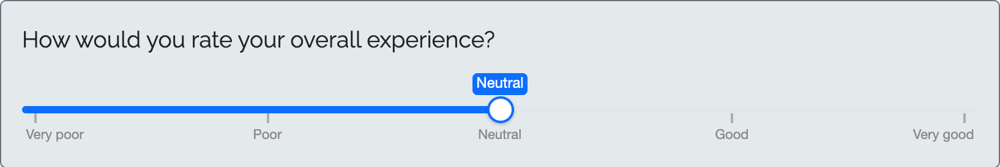
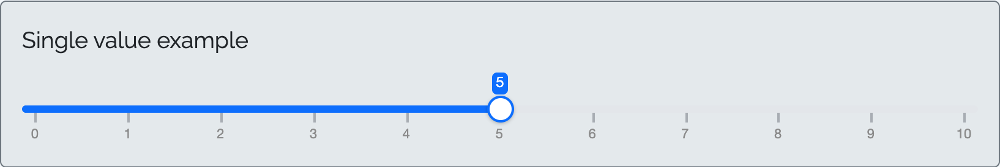
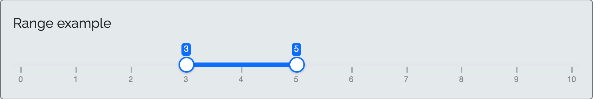
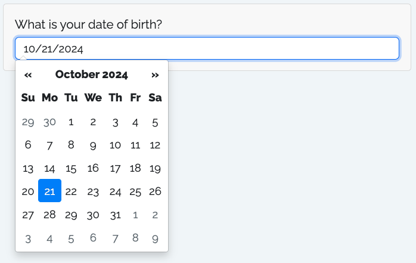
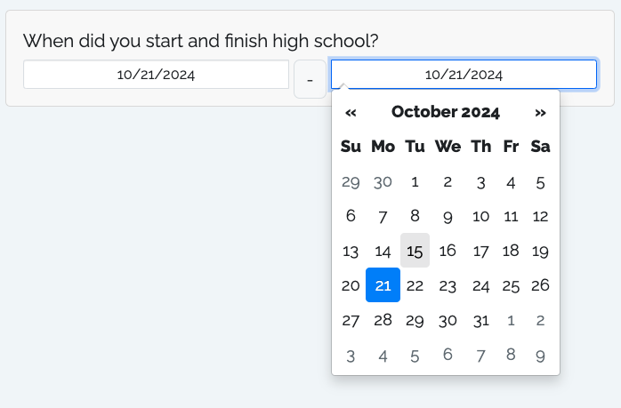

# Question Types

All questions in a surveydown survey are created using the `sd_question()` function. Calls to `sd_question()` should be put inside code chunks in the **survey.qmd** file to define the survey questions.

The function requires the following three arguments:

- `id`: A unique identifier for the question, which will be used as the variable name in the resulting survey data.
- `label`: The label that will be displayed on the question in the survey.
- `type`: The type of question.

Many question types also require an `option` argument, which is a named vector of options for the question (e.g. for [multiple choice](#mc) questions). The function also includes many other optional arguments that can be used to customize the question appearance and behavior. See the [package documentation](https://pkg.surveydown.org/reference/sd_question) for more details.

Below are examples of each question type.

## `text`

Use `type = 'text'` to specify a text input type question.

## Output

Write a word:

\*

## Code

```` markdown
```{r}
sd_question(
  type  = "text",
  id    = "word",
  label = "Write a word:"
)
```
````

## `textarea`

Use `type = 'textarea'` to specify a text area input type question.

## Output

Write a paragraph:

\*

## Code

```` markdown
```{r}
sd_question(
  type  = "textarea",
  id    = "paragraph",
  label = "Write a paragraph:"
)
```
````

## `numeric`

Use `type = 'numeric'` to specify a numeric input type.

## Output

What’s your age?

\*

## Code

```` markdown
```{r}
sd_question(
  type  = 'numeric',
  id    = 'age',
  label = "What's your age?"
)
```
````

## `mc`

Use `type = 'mc'` to specify a multiple choice type question with a single choice option.

## Output

Which artist do you prefer most from this list?

Taylor Swift

Beyoncé

Adele

Rihanna

Lady Gaga

Ed Sheeran

Drake

\*

## Code

```` markdown
```{r}
sd_question(
  type   = 'mc',
  id     = 'artist',
  label  = "Which artist do you prefer most from this list?",
  option = c(
    "Taylor Swift" = "taylor_swift",
    "Beyoncé"      = "beyonce",
    "Adele"        = "adele",
    "Rihanna"      = "rihanna",
    "Lady Gaga"    = "ladygaga",
    "Ed Sheeran"   = "ed_sheeran",
    "Drake"        = "drake"
  )
)
```
````

## `mc_multiple`

Use `type = 'mc_multiple'` to specify a multiple choice type question with multiple selection enabled.

## Output

What are your favorite Taylor Swift albums (select all that apply)?

Taylor Swift (2006)

Fearless (2008)

Speak Now (2010)

Red (2012)

1989 (2014)

Reputation (2017)

Lover (2019)

Folklore (2020)

Evermore (2020)

Midnights (2022)

\*

## Code

```` markdown
```{r}
sd_question(
  type  = 'mc_multiple',
  id    = 'swift',
  label = "What are your favorite Taylor Swift albums (select all that apply)?",
  option = c(
    "Taylor Swift (2006)" = "taylor_swift",
    "Fearless (2008)"     = "fearless",
    "Speak Now (2010)"    = "speak_now",
    "Red (2012)"          = "red",
    "1989 (2014)"         = "1989",
    "Reputation (2017)"   = "reputation",
    "Lover (2019)"        = "lover",
    "Folklore (2020)"     = "folklore",
    "Evermore (2020)"     = "evermore",
    "Midnights (2022)"    = "midnights"
  )
)
```
````

## `mc_buttons`

Use `type = 'mc_buttons'` to generate the button version of `mc`.

## Output

Which fruit do you prefer most from this list?

  

Apple Banana Pear Strawberry Grape Mango Watermelon

\*

## Code

```` markdown
```{r}
sd_question(
  type   = 'mc_buttons',
  id     = 'fruit',
  label  = "Which fruit do you prefer most from this list?",
  option = c(
    "Apple"      = "apple",
    "Banana"     = "banana",
    "Pear"       = "pear",
    "Strawberry" = "strawberry",
    "Grape"      = "grape",
    "Mango"      = "mango",
    "Watermelon" = "watermelon"
  )
)
```
````

Use `direction = "vertical"` to display the button options vertically.

## Output

Which fruit do you prefer most from this list?

  

Apple Banana Pear Strawberry Grape Mango Watermelon

\*

## Code

```` markdown
```{r}
sd_question(
  type   = 'mc_buttons',
  id     = 'fruit_vertical',
  label  = "Which fruit do you prefer most from this list?",
  option = c(
    "Apple"      = "apple",
    "Banana"     = "banana",
    "Pear"       = "pear",
    "Strawberry" = "strawberry",
    "Grape"      = "grape",
    "Mango"      = "mango",
    "Watermelon" = "watermelon"
  ), 
  direction = "vertical"
)
```
````

## `mc_multiple_buttons`

Use `type = 'mc_multiple_buttons'` to generate the button version of `mc_multiple`.

## Output

Which are your favorite Michael Jackson songs (select all that apply)?

  

Thriller (1982)

Billie Jean (1982)

Beat It (1982)

Man in the Mirror (1987)

Smooth Criminal (1987)

Black or White (1991)

Bad (1987)

Human Nature (1982)

\*

## Code

```` markdown
```{r}
sd_question(
  type  = 'mc_multiple_buttons',
  id    = 'michael_jackson',
  label = "Which are your favorite Michael Jackson songs (select all that apply)?",
  option = c(
    "Thriller (1982)"          = "thriller",
    "Billie Jean (1982)"       = "billie_jean",
    "Beat It (1982)"           = "beat_it",
    "Man in the Mirror (1987)" = "man_in_the_mirror",
    "Smooth Criminal (1987)"   = "smooth_criminal",
    "Black or White (1991)"    = "black_or_white",
    "Bad (1987)"               = "bad",
    "Human Nature (1982)"      = "human_nature"
  )
)
```
````

Use `direction = "vertical"` to display the button options vertically.

## Output

Which are your favorite Michael Jackson songs (select all that apply)?

  

Thriller (1982)

Billie Jean (1982)

Beat It (1982)

Man in the Mirror (1987)

Smooth Criminal (1987)

Black or White (1991)

Bad (1987)

Human Nature (1982)

\*

## Code

```` markdown
```{r}
sd_question(
  type  = 'mc_multiple_buttons',
  id    = 'michael_jackson_vertical',
  label = "Which are your favorite Michael Jackson songs (select all that apply)?",
  option = c(
    "Thriller (1982)"          = "thriller",
    "Billie Jean (1982)"       = "billie_jean",
    "Beat It (1982)"           = "beat_it",
    "Man in the Mirror (1987)" = "man_in_the_mirror",
    "Smooth Criminal (1987)"   = "smooth_criminal",
    "Black or White (1991)"    = "black_or_white",
    "Bad (1987)"               = "bad",
    "Human Nature (1982)"      = "human_nature"
  ), 
  direction = "vertical"
)
```
````

## `mc_image`

Use `type = 'mc_image'` for a single-choice question where each option is a clickable image card. Provide an `image` argument: a vector of image paths or URLs, one per option, in the same order as `option`. Paths are used directly in the image `src`, so they should resolve against your survey’s `images` or `www` folder (e.g. `"images/cat.png"`) or be full URLs.

> **NOTE:**
>
> For image-choice questions, the `option` **names** control whether a text caption appears beneath each image:
>
> - **With captions** - give your options names, e.g. `option = c('Cat' = 'cat', 'Dog' = 'dog')`. The names (“Cat”, “Dog”) are shown as captions; the values (“cat”, “dog”) are stored in your data.
> - **Without captions (images only)** - pass an *unnamed* vector, e.g. `option = c('cat', 'dog')`. No captions are shown, and the values (“cat”, “dog”) are still stored in your data.
>
> This is different from the other multiple choice types, where an unnamed option vector uses the values as the visible labels. For image questions an unnamed vector means “no caption”.

> **NOTE:**
>
> This widget only renders well in a Shiny environment, so we just show a screenshot here.

**With captions**:

## Output


## Code

```` markdown
```{r}
sd_question(
  type   = 'mc_image',
  id     = 'pet',
  label  = "Which pet do you prefer?",
  option = c('Cat' = 'cat', 'Dog' = 'dog'),
  image  = c('images/cat.png', 'images/dog.png')
)
```
````

**Without captions** (unnamed `option`, images only):

## Output


## Code

```` markdown
```{r}
sd_question(
  type   = 'mc_image',
  id     = 'pet_no_caption',
  label  = "Which pet do you prefer?",
  option = c('cat', 'dog'),
  image  = c('images/cat.png', 'images/dog.png')
)
```
````

## `mc_multiple_image`

Use `type = 'mc_multiple_image'` for the multiple-selection version of `mc_image`, where respondents can select more than one image card.

> **NOTE:**
>
> This widget only renders well in a Shiny environment, so we just show a screenshot here.

## Output


## Code

```` markdown
```{r}
sd_question(
  type   = 'mc_multiple_image',
  id     = 'pets_owned',
  label  = "Which pets have you owned? (select all that apply)",
  option = c('Cat' = 'cat', 'Dog' = 'dog'),
  image  = c('images/cat.png', 'images/dog.png')
)
```
````

## `select`

Use `type = 'select'` to specify a drop down select type question.

## Output

What is the highest level of education you have attained?

Choose an option... Did not attend high school Some high school High school graduate Some college College Graduate Work Prefer not to say

\*

## Code

```` markdown
```{r}
sd_question(
  type  = 'select',
  id    = 'education',
  label = "What is the highest level of education you have attained?",
  option = c(
    "Did not attend high school" = "hs_no",
    "Some high school"           = "hs_some",
    "High school graduate"       = "hs_grad",
    "Some college"               = "college_some",
    "College"                    = "college_grad",
    "Graduate Work"              = "grad",
    "Prefer not to say"          = "no_response"
  )
)
```
````

## `slider`

> **NOTE:**
>
> This widget only renders well in a Shiny environment, so we just show a screenshot here.

## Output



## Code chunk

```` markdown
```{r}
sd_question(
  type  = 'slider',
  id    = 'experience',
  label = "How would you rate your overall experience?",
  option = c(
    "Very poor" = "very_poor",
    "Poor"      = "poor",
    "Neutral"   = "neutral",
    "Good"      = "good",
    "Very good" = "very_good"
  ),
  selected = 'neutral'
)
```
````

## `slider_numeric`

> **NOTE:**
>
> This widget only renders well in a Shiny environment, so we just show a screenshot here.

If your slider uses numeric inputs, use the `slider_numeric` question type. This type of slider can be used for either single sliders or dual sliders that define a range of values.

**Single slider**:

## Output



## Code chunk

```` markdown
```{r}
sd_question(
  type = "slider_numeric", 
  id = 'slider_single_val',  
  label = 'Single value example', 
  option = seq(0, 10, 1)
)
```
````

**Range slider**:

## Output



## Code chunk

```` markdown
```{r}
sd_question(
  type = "slider_numeric", 
  id = 'slider_range',  
  label = 'Range example', 
  option = seq(0, 10, 1), 
  default = c(3, 5)
)
```
````

## `date`

Use `type = 'date'` to specify a date input type. The date value will be today’s date by default. Upon clicking on the text box, you are provided with a date dialog box to choose date from.

> **NOTE:**
>
> This widget only renders well in a Shiny environment, so we just show a screenshot here.

## Output



## Code

```` markdown
```{r}
sd_question(
  type  = 'date',
  id    = 'dob',
  label = "What is your date of birth?"
)
```
````

## `daterange`

Use `type = 'daterange'` to specify a date range input type.

> **NOTE:**
>
> This widget only renders well in a Shiny environment, so we just show a screenshot here.

## Output



## Code

```` markdown
```{r}
sd_question(
  type  = 'daterange',
  id    = 'hs_date',
  label = "When did you start and finish high school?"
)
```
````

## `matrix`

Use `type = 'matrix'` to specify a matrix input type.

## Output

Please indicate your agreement with the following statements.

[TABLE]

\*

## Code

```` markdown
```{r}
sd_question(
  type   = "matrix",
  id     = "car_preference",
  label  = "Please indicate your agreement with the following statements.",
  row    = c(
    "I would buy a gasoline car." = "buy_gasoline",
    "I would buy an EV."          = "buy_ev"
  ),
  option = c(
    "Disagree" = "disagree",
    "Neutral"  = "neutral",
    "Agree"    = "agree"
  )
)
```
````

## `matrix_multiple`

Use `type = 'matrix_multiple'` to specify a matrix input type where each row allows **multiple** selections (checkboxes) instead of a single selection (radio buttons).

Each row becomes its own sub-question with the ID `<question_id>_<row_id>`, stored as a separate column in the resulting data. Multiple selections within a row are stored as a single pipe-separated string (e.g., `"online|app"`), just like the [`mc_multiple`](#mc_multiple) type.

## Output

How have you purchased each of the following? (select all that apply)

[TABLE]

\*

## Code

```` markdown
```{r}
sd_question(
  type   = "matrix_multiple",
  id     = "purchase_channels",
  label  = "How have you purchased each of the following? (select all that apply)",
  row    = c(
    "Groceries"   = "groceries",
    "Electronics" = "electronics"
  ),
  option = c(
    "In store" = "store",
    "Online"   = "online",
    "Mobile app" = "app"
  )
)
```
````

Back to top
