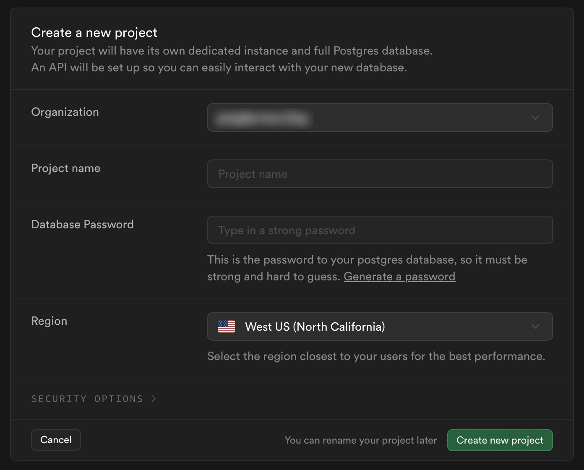
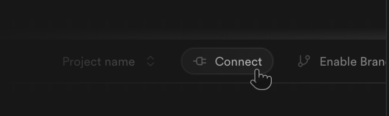
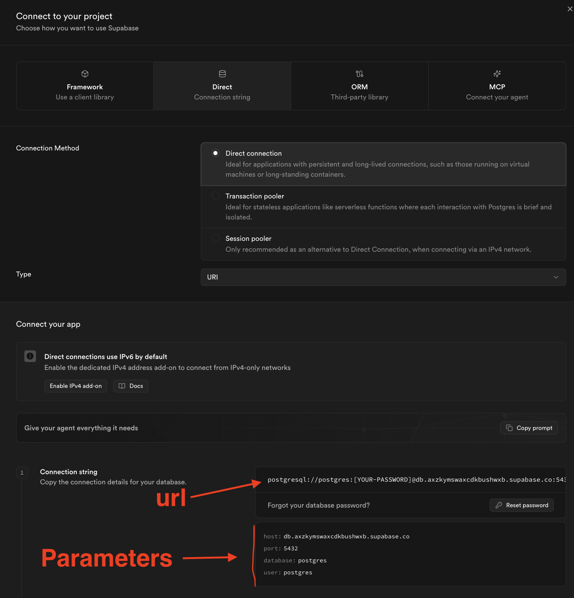
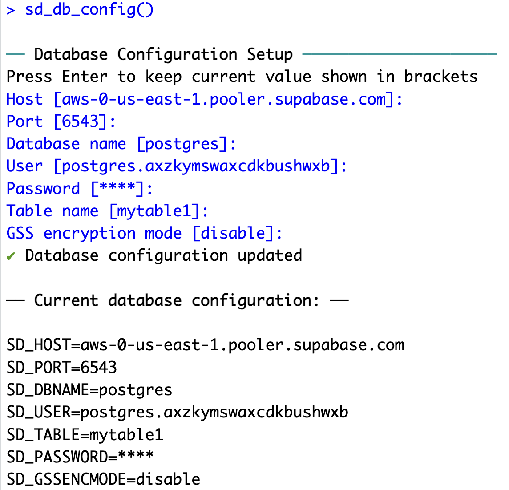

# Storing Data

Survey response data is stored in a PostgreSQL database. We recommend using [Supabase](https://supabase.com/) as a free and open-source option, though you can use any service you want. In this guide, we’ll walk you through the steps for setting up a Supabase project and connecting your surveydown survey to it.

> **TIP:**
>
> Rather not do this by hand? The [surveydown agentic skill](agentic-skill.llms.md#connect-a-database) can walk through this whole process for you: creating a Supabase project, storing your credentials, and switching the survey to `mode: database`. See [Connect a database](agentic-skill.llms.md#connect-a-database).

## Survey modes

surveydown supports three operating modes — `database`, `preview`, and `local` — controlled by the `mode` setting in your `survey.qmd` YAML header. These modes determine how and where your response data is stored. See the [Survey Settings](../docs/survey-settings.llms.md#mode) page for full documentation on each mode.

In short: set `mode: preview` while building your survey, which stores data locally, then remove it (or set it to `database`) before deploying to store in a database, or set it to `local` to run the survey on a single computer and store data locally.

## Setting up a Supabase project

First, navigate to the [Supabase](https://supabase.com/) website and create an account.

Once you are logged in, the page will prompt you to create a project (it’s a green button). Click on it and select your organization. A dialog box will pop up like this:

  



  

Fill in the project name and give it a strong password. Choose a region that is close to you (or close to your survey audience). All settings can be modified at any time.

> **NOTE:**
>
> Each Supabase project is a database that can store multiple tables. Since each surveydown survey requires only one table, you can use the same Supabase project for multiple surveydown surveys.

## Getting your Supabase credentials

Once your Supabase project is ready, click on the “connect” button at the top, it should look like this:

  



  

On the connection page, click the “Direct” connection option, then select “Transaction pooler”. There you can see the connection URL at the top as well as the individual connection parameters below it. It should look something like this:

  



  

You’ll read the **individual connection parameters** shown below the URL (host, port, database name, user, password) to configure your database in surveydown.

## Storing your database credentials

Before connecting to your database, you need to store your credentials. There are two ways to do this:

### Option 1: Interactive setup (recommended)

Run `sd_db_config()` with no arguments:

``` downlit
surveydown::sd_db_config()
```

This will prompt you to enter each database credential one by one — host, port, database name, user, password, and table name — which you can read off the connection parameters shown on the Supabase page. The current values are shown in square brackets; press Enter to keep one (e.g. the default `"responses"` table name). When done it should look like this:

  



  

### Option 2: Passing parameters directly

Instead of the interactive prompts, you can pass any of the connection parameters as arguments to `sd_db_config()`:

``` downlit
surveydown::sd_db_config(
  host     = "aws-0-us-east-1.pooler.supabase.com",
  port     = "6543",
  dbname   = "postgres",
  user     = "postgres.xxxx",
  password = "YOUR-PASSWORD",
  table    = "responses"
)
```

Any parameter you omit keeps its current stored value (or its default), so this also works for changing just one field — see [Modifying credentials](#modifying-credentials) below.

### The `.env` file

Once you have entered your credentials, the function will store them in a `.env` file in your project folder. **We strongly recommend that you do not manually edit this file or share it with others as it stores all of your database credentials, including your password.**

## Modifying credentials

If you want to modify your credentials stored in the `.env` file, you can just run `sd_db_config()` again and press ‘Enter’ on any parameter you want to leave unchanged while modifying the ones you want to change.

You can also pass any of the parameters as arguments to `sd_db_config()` to change them. For example, if you wanted to only change the table name, you could do this:

``` downlit
sd_db_config(table = 'mytable')
```

Once run in the R console, a message will print out confirming that the stored `table` parameter will now be `mytable`.

You can pass any of the following as arguments to update them: `host`, `dbname`, `port`, `user`, `table`, and `password`.

Finally, you can also view / modify your database credentials using the `sdstudio` package, a companion GUI package for surveydown surveys. To do this, launch the app by running this command in the R console:

``` downlit
sdstudio::launch()
```

This will open a new browser window where you can navigate to the dashboard for your project. Click on the “Connection Settings” tab to see and edit your database credentials. Once you have made changes, click on the “Test Connection” button to save your updated credentials.

See the [Local Dashboard](local-dashboard.llms.md) page for more information.

## Connecting to the database

Once your credentials are stored in a `.env` file, add the following to your **app.R** file in the global scope to connect your survey to the database:

``` downlit
db <- sd_db_connect()
```

This reads your credentials from the `.env` file. If the connection is successful, a message prints to the console confirming it. The survey mode (`database`, `preview`, or `local`) is controlled via the `mode` key in your `survey.qmd` YAML — not by `sd_db_connect()`.

If the database connection fails (e.g. no `.env` file or incorrect credentials), a red banner appears at the bottom of every survey page. See [Trouble connecting?](#trouble-connecting) below if this happens unexpectedly.

> **NOTE:**
>
> The `ignore = TRUE` argument in `sd_db_connect()` is deprecated. Use `mode: preview` in your YAML instead.

## Table creation and data operations

You never need to manually create a table in the database - it gets automatically created after you first run the survey. After you first set up the config and a `.env` file is properly created, run your survey locally and click past the first page, then you should see the table get created in the database. You can view it directly on supabase (if you’re using supabase), or you can see the table using the dashboard by running `sd_dashboard()`.

The data gets updated in the database on every page turn (each time you push a next button) and after you close the browser, which is usually at the end of the survey, but just in case you close it early it will write to the database then too. This is why you usually have to click past the first page after initial configuration to see the table in the database.

## Trouble connecting?

If you’re having trouble connecting to your database, try these steps:

- Are you certain your password is correct? You can open your .env file in a text reader app or in your IDE to check it.
- Are you certain your credentials are correct? If you run [`surveydown::sd_db_config()`](https://pkg.surveydown.org/reference/sd_db_config.html) again in your R console, you can see the current values stored in the `[]` symbols to check if those are correct.
- Consider modifying the `gssencmode` parameter. Take a look [here](https://surveydown.org/faq.html#im-having-trouble-with-the-database-connection).

## Cookies

By default, the data on each page will be locally stored in the browser cookies, though you can turn this feature off if you wish (see [here](survey-settings.llms.md#cookies)).

This is done so that the session state can be restored should a respondent lose an internet connection or close the browser on accident, etc. The responses on each page will not be written to the database until the respondent clicks the next button or if they close the browser.

Back to top
