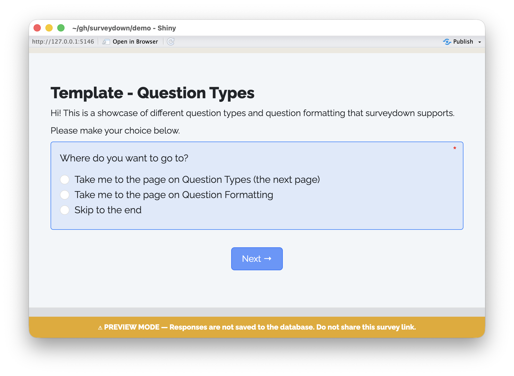
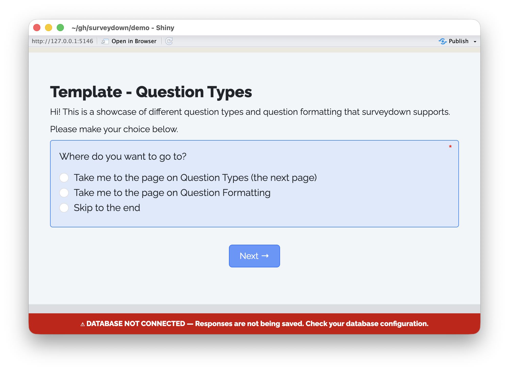

Survey response data is stored in a PostgreSQL database. We recommend using  as a free and open-source option, though you can use any service you want. In this guide, we'll walk you through the steps for setting up a Supabase project and connecting your surveydown survey to it.

## Survey modes

`sd_db_connect()` supports three operating modes, controlled by the `mode` argument:

| Mode | CSV file | Banner | Use case |
|------|----------|--------|----------|
| `"database"` (default) | — | — | Live deployment; responses stored in PostgreSQL. |
| `"preview"` | `preview_data.csv` | Yellow footer banner on every page | Testing before deployment. |
| `"local"` | `local_data.csv` | None | Intentional offline data collection. |

```r
db <- sd_db_connect()                   # database mode (default)
db <- sd_db_connect(mode = "preview")   # preview mode
db <- sd_db_connect(mode = "local")     # local/offline mode
```

The `"preview"` mode is particularly useful for catching a common mistake: accidentally deploying a live survey without a database connection. A yellow banner appears at the bottom of every page making it immediately obvious to anyone opening the survey that it is not recording responses to the database.

<br>
<center>

</center>
<br>

The `"local"` mode is designed for situations where you intentionally want to run a survey without an internet connection and collect data locally in a CSV file. Unlike `"preview"` mode, no banner is shown — the assumption is that this is a deliberate choice. Responses are saved to `local_data.csv` in your project folder.

::: {.callout-note}
The `ignore = TRUE` argument is deprecated. Use `mode = "preview"` instead.
:::

## Failed database connection

If `mode = "database"` is set (or no mode is specified) but the database connection fails — for example because no `.env` file exists or the credentials are incorrect — a red banner will appear at the bottom of every page:

<br>
<center>

</center>
<br>

This is distinct from `"preview"` mode: the red banner signals an unexpected failure rather than an intentional testing state. Responses will not be saved. If you see this banner when running a live survey, check your `.env` file and credentials (see [Trouble connecting?](#trouble-connecting) below).

## Setting up a Supabase project

First, navigate to the  website and create an account.

Once you are logged in, the page will prompt you to create a project (it's a green button). Click on it and select your organization. A dialog box will pop up like this:

<br>
<center>

</center>
<br>

Fill in the project name and give it a strong password. Choose a region that is close to you (or close to your survey audience). All settings can be modified at any time.

::: {.callout-note}

Each Supabase project is a database that can store multiple tables. Since each surveydown survey requires only one table, you can use the same Supabase project for multiple surveydown surveys.

:::

## Getting your Supabase credentials

Once your Supabase project is ready, click on the "connect" button at the top, it should look like this:

<br>
<center>

</center>
<br>

On the connection page, click the "Direct" connection option, then select "Transaction pooler". There if you scroll down you can see your connection parameters. It should look something like this:

<br>
<center>

</center>
<br>

You will need these parameters and your password to connect to your database in surveydown.

## Storing your database credentials

Before connecting to your database, you need to store your credentials. You can do this by running the following code in your R console:

```{r}
surveydown::sd_db_config()
```

This function will prompt you to enter your database credentials and password, one by one. The current credential values will be shown in square brackets. When done it should look like this:

<br>
<center>

</center>
<br>

Once you have entered your credentials, the function will store them in a `.env` file in your project folder. **We strongly recommend that you do not manually edit this file or share it with others as it stores all of your database credentials, including your password.**

## Modifying credentials 

If you want to modify your credentials stored in the `.env` file, you can just run `sd_db_config()` again and press 'Enter' on any parameter you want to leave unchanged while modifying the ones you want to change. 

You can also pass any of the parameters as arguments to `sd_db_config()` to change them. For example, if you wanted to only change the table name, you could do this:

```{r}
sd_db_config(table = 'mytable')
```

Once run in the R console, a message will print out confirming that the stored `table` parameter will now be `mytable`.

You can pass any of the following as arguments to update them: `host`, `dbname`, `port`, `user`, `table`, and `password`.

Finally, you can also view / modify your database credentials using the `sdstudio` package, a companion GUI package for surveydown surveys. To do this, launch the app by running this command in the R console:

```{r}
sdstudio::launch()
```

This will open a new browser window where you can navigate to the dashboard for your project. Click on the "Connection Settings" tab to see and edit your database credentials. Once you have made changes, click on the "Test Connection" button to save your updated credentials.

See the [Local Dashboard](local-dashboard.html) page for more information.

## Connecting to your database in surveydown

Now that you have set your credentials stored, you can connect to your database in surveydown by running the following code in your **app.R** file:

```{r}
db <- sd_db_connect()
```

You do not need to specify any arguments to this function as it will automatically use the credentials stored in your `.env` file. If the connection is successful, you should see a message in the console that says "✔ Running in **database** mode. Successfully connected to the database."

To test your survey without connecting to the database, use `mode = "preview"`:

```{r}
db <- sd_db_connect(mode = "preview")
```

In preview mode, no database connection is attempted and data is stored in a local `preview_data.csv` file. A red banner will also appear at the bottom of every survey page to make it clear the survey is not recording responses to the database. This is useful when you are still editing your survey and do not want to store any data in your database yet.

To run the survey offline without an internet connection and intentionally collect data locally, use `mode = "local"`:

```{r}
db <- sd_db_connect(mode = "local")
```

In local mode, no database connection is attempted and no banner is shown. Responses are saved to a `local_data.csv` file in your project folder.

## Table creation and data operations

You never need to manually create a table in the database - it gets automatically created after you first run the survey. After you first set up the config and a `.env` file is properly created, run your survey locally and click past the first page, then you should see the table get created in the database. You can view it directly on supabase (if you're using supabase), or you can see the table using the dashboard by running `sd_dashboard()`. 

The data gets updated in the database on every page turn (each time you push a next button) and after you close the browser, which is usually at the end of the survey, but just in case you close it early it will write to the database then too. This is why you usually have to click past the first page after initial configuration to see the table in the database. 

## Trouble connecting?

If you're having trouble connecting to your database, try these steps:

- Are you certain your password is correct? You can open your .env file in a text reader app or in your IDE to check it.
- Are you certain your credentials are correct? If you run `surveydown::sd_db_config()` again in your R console, you can see the current values stored in the `[]` symbols to check if those are correct.
- Consider modifying the `gssencmode` parameter. Take a look [here](https://surveydown.org/faq.html#im-having-trouble-with-the-database-connection).

## Cookies 

By default, the data on each page will be locally stored in the browser cookies, though you can turn this feature off if you wish (see [here](survey-settings.html#cookies)).

This is done so that the session state can be restored should a respondent lose an internet connection or close the browser on accident, etc. The responses on each page will not be written to the database until the respondent clicks the next button or if they close the browser.

